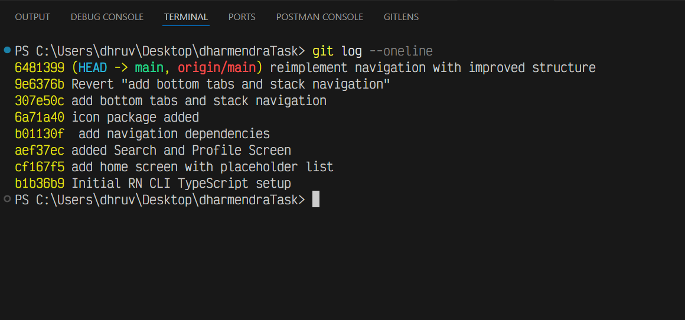

# DharmendaTask Navigation Demo

This is a **React Native** project demonstrating a real-world scenario of implementing, reverting, and improving a navigation structure.

## Tech Stack

- **Framework**: React Native (0.83.1)
- **Navigation**: React Navigation 7 (Bottom Tabs, Native Stack)
- **Icons**: Lucide React Native
- **Language**: TypeScript

## Getting Started

1.  **Install dependencies**:

    ```sh
    npm install
    # or
    yarn install
    ```

2.  **Start Metro**:

    ```sh
    npm start
    # or
    yarn start
    ```

3.  **Run the app**:
    ```sh
    npm run android
    # or
    npm run ios
    ```

---

Note: The UI styling in this project is intentionally kept minimal, as the primary focus of this assessment is on code structure, navigation architecture, TypeScript usage, and Git workflow, strictly adhering to the requirements outlined in the assessment document.

# 🔁 Revert Task Explanation

As part of the assessment, I simulated a real-world scenario where an initial implementation needs to be reverted and improved.

## Step 1: Initial Navigation Implementation (v1)

Implemented basic navigation using:

- Bottom Tab Navigator
- Stack Navigator inside tabs

This version established the foundational navigation structure.

**Commit:**
`add bottom tabs and stack navigation`

## Step 2: Reverting the Initial Implementation

After reviewing the initial approach, I reverted the navigation changes using `git revert`.

`git revert` was intentionally chosen instead of `git reset` to:

- Preserve commit history
- Maintain transparency for future developers
- Follow best practices used in team environments

**Revert Commit:**
`revert: remove bottom tabs and stack navigation`

## Step 3: Improved Navigation Re-implementation (v2)

Re-implemented navigation with an improved, more scalable approach:

- Introduced separate stack navigators per tab
- Centralized stack creation to reduce duplication
- Added a custom bottom tab bar

This structure provides better separation of concerns and is easier to extend as the app grows.

**Commit:**
`reimplement navigation with improved structure`

## Versioning & Traceability

Both navigation implementations are preserved in Git history.

Tags were added for easy reference:

- `navigation-v1` → Initial navigation implementation
- `navigation-v2` → Improved navigation implementation

This approach allows any developer to inspect, compare, or restore previous implementations if required.

## Why This Approach?

This workflow mirrors real production scenarios where:

- Initial solutions are iterated upon
- Changes are reverted safely
- Improvements are introduced without losing historical context

It demonstrates clean Git practices, thoughtful decision-making, and team-oriented development.

### Revert Task Evidence

- Initial navigation was implemented and committed
- The navigation commit was reverted using `git revert`
- Navigation was reimplemented with an improved structure

Relevant commits:

- add bottom tabs and stack navigation
- Revert "add bottom tabs and stack navigation"
- reimplement navigation with improved structure

### Git History


